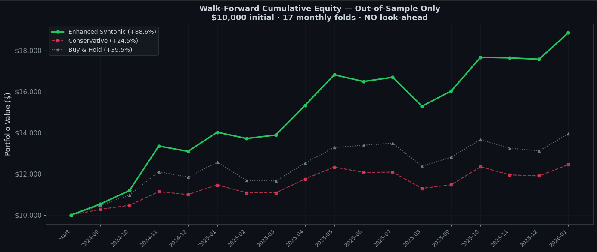

# Syntonic Portfolio

[](https://colab.research.google.com/github/jpbronsard/syntonic-portfolio/blob/main/notebooks/Syntony_Financial_WalkForward.ipynb)

**Theory-derived adaptive portfolio strategy with zero tunable parameters.**

The Syntonic portfolio strategy computes optimal rebalancing timing and position sizing from first principles using the scaling law:

$$\tau^* = \kappa \sqrt{\frac{\sigma^2}{\lambda}}$$

where σ² is the rolling return variance, λ is the innovation rate (how fast market conditions are changing), and κ = 1.0 is theory-determined — not tuned.

Momentum strategies, volatility targeting, and risk parity all implicitly navigate the same temporal geometry. The Syntonic framework makes this structure explicit.

---

## Results

### Walk-Forward Out-of-Sample — 17 Monthly Folds (Sep 2024 – Jan 2026)

| Strategy | Cumulative OOS Return | vs. Buy & Hold | t-statistic | Win Rate |
|---|---|---|---|---|
| **Enhanced Syntonic** | **+88.6%** | **2.24×** | **3.15 (p < 0.01)** | **88% (15/17)** |
| Conservative | +24.5% | 0.62× | −1.59 (n.s.) | 35% (6/17) |
| Buy & Hold | +39.5% | 1.00× | — | — |

**The negative result matters most.** The conservative strategy (coherence × inverse-volatility, no momentum) *destroys* value — underperforming passive Buy & Hold. The enhanced strategy (coherence × momentum + volatility scaling) generates statistically significant alpha. Same formula, same κ = 1.0. The mechanism is the interaction.



### Mechanism Isolation

This is the key finding. Two strategies using the same Syntonic formula, differing only in whether momentum is included:

| Component | Conservative | Enhanced |
|---|---|---|
| Coherence Φ gating | ✓ | ✓ |
| Inverse-volatility weighting | ✓ | ✓ |
| Rebalancing at τ* intervals | ✓ | ✓ |
| Momentum (positive only) | ✗ | ✓ |
| Volatility scaling | ✗ | ✓ |

Conservative fails (t = −1.59). Enhanced succeeds (t = 3.15). The alpha originates from the interaction between coherence and directional signal — Φ tells you *when* to act, momentum tells you *which direction*.

### All 17 Folds

| Month | Syntonic | Buy & Hold | Alpha | Win? |
|---|---|---|---|---|
| Sep 2024 | +5.3% | +4.6% | +0.7% | ✓ |
| Oct 2024 | +6.3% | +5.0% | +1.3% | ✓ |
| Nov 2024 | +19.3% | +10.2% | +9.1% | ✓ |
| Dec 2024 | −1.9% | −2.2% | +0.2% | ✓ |
| Jan 2025 | +7.1% | +6.1% | +0.9% | ✓ |
| Feb 2025 | −2.2% | −7.0% | +4.9% | ✓ |
| Mar 2025 | +1.2% | −0.2% | +1.5% | ✓ |
| Apr 2025 | +10.4% | +7.5% | +2.9% | ✓ |
| May 2025 | +9.7% | +6.0% | +3.6% | ✓ |
| Jun 2025 | −1.9% | +0.8% | −2.7% | ✗ |
| Jul 2025 | +1.2% | +0.8% | +0.5% | ✓ |
| Aug 2025 | −8.4% | −8.3% | −0.1% | ✗ |
| Sep 2025 | +4.8% | +3.6% | +1.2% | ✓ |
| Oct 2025 | +10.2% | +6.6% | +3.6% | ✓ |
| Nov 2025 | −0.2% | −3.0% | +2.9% | ✓ |
| Dec 2025 | −0.4% | −1.0% | +0.6% | ✓ |
| Jan 2026 | +7.3% | +6.3% | +1.0% | ✓ |

### Regime Analysis

| Regime | Months | Mean Alpha | Win Rate |
|---|---|---|---|
| Bull (B&H > +3%) | 9 | +2.71% | 100% |
| Bear (B&H < −3%) | 3 | +2.55% | 67% |
| Flat (\|B&H\| ≤ 3%) | 5 | +0.01% | 80% |

Alpha is positive across all regimes. The strategy adapts — it doesn't just ride beta.

---

## How It Works

The strategy computes three quantities daily, per asset:

1. **σ²(t)** — rolling 20-day variance of log-returns (noise level)
2. **λ(t)** — rolling 20-day variance of return differences (innovation rate)
3. **τ\*(t) = κ √(σ²(t) / λ(t))** — optimal integration timescale

From these, it derives:

- **Coherence Φ(t)** — proximity to the adaptation optimum. High Φ = reliable signals.
- **Allocation weight** ∝ (Φ × 0.5 + max(momentum, 0) × 100) / volatility
- **Volatility scaling** — target 15% annualized portfolio volatility
- **Rebalancing** — at τ*-determined intervals, not fixed calendar dates

### Geometric Mapping

Each component maps onto a specific property from the Syntony Principle:

| Component | Geometric Property | V4.1 Reference |
|---|---|---|
| Rebalance at τ* | Equal Partition Property | Eq. (36) |
| Φ gates momentum | Coherence maximization | Def. 12.1 |
| Vol scaling | Rescaling symmetry (UTAE Axiom U2) | Thm. 19.2 |
| Momentum × Φ weighting | Directional exploitation | Prop. 12.2 |

This mapping was designed from the theory *before* backtesting — not reverse-engineered from results.

### Parameters

| Parameter | Value | Source |
|---|---|---|
| κ | 1.0 | Theory-determined (Atlas Theory 5, Merton portfolio rebalancing) |
| Rolling window | 20 days | Convention (~1 trading month) |
| Target volatility | 15% annualized | Fixed |
| Transaction cost | 10 bps per rebalance | Fixed |
| Assets | SPY, BTC-USD, GLD | Fixed |

κ = 1.0 is the only constant from the Syntony Principle. It was not tuned.

---

## Quick Start

The walk-forward notebook runs directly in Google Colab:

| Notebook | Colab |
|---|---|
| Walk-Forward Validation | [](https://colab.research.google.com/github/jpbronsard/syntonic-portfolio/blob/main/notebooks/Syntony_Financial_WalkForward.ipynb) |

Expected runtime: ~5 minutes on Colab free tier (CPU only — no GPU required).

---

## Walk-Forward Protocol

Expanding-window design with zero look-ahead:

| Step | Description |
|---|---|
| 1 | Minimum 6 months training data |
| 2 | Freeze model parameters |
| 3 | Test on next calendar month |
| 4 | Record out-of-sample result |
| 5 | Expand training window, repeat |

17 test folds (September 2024 – January 2026). At no point does future data influence any decision.

---

## Limitations

These are real and should inform how you interpret the results.

- **17 months is statistically thin.** Institutional standards require 60+ folds across full market cycles including genuine crises (−20% or worse).
- **No crisis stress test.** Worst B&H month was −8.3% (Aug 2025). The strategy is untested through a 2008 or March 2020 scenario.
- **Three assets.** SPY, BTC, GLD are favorably uncorrelated. A 30-asset universe may dilute or amplify the effect.
- **Simplified transaction costs.** 10 bps flat doesn't capture real BTC slippage (30–50 bps volatile), spread widening, or leverage costs.
- **Daily interpolated data.** Not tick-level. Smooths intraday volatility and flash crashes.
- **IS → OOS degradation: ~35%.** Full backtest 3.4× B&H → walk-forward 2.24× B&H.

---

## Cross-Domain Connection

The same formula τ* = κ√(σ²/λ), with the same κ ≈ 1.0, independently governs:

| Domain | Result | κ | Status |
|---|---|---|---|
| **Deep learning** | Matches Adam on CIFAR-10/100, zero tuning | 1.0007 (MNIST), 1.0 (CIFAR) | [Published](https://doi.org/10.5281/zenodo.18527033) |
| **Financial markets** | 2.24× B&H OOS, t = 3.15 | 1.0 | [Published](https://doi.org/10.5281/zenodo.18642832) |
| **Quadcopter control** | 61.5% improvement (simulation) | ~1.0 | In preparation |
| **Computational** | R² = 0.9943 across 6 orders of magnitude | 1.0003 | [Published](https://doi.org/10.5281/zenodo.17596470) |

Adam didn't know it was Syntonic. Neither did momentum strategies. The same temporal geometry hides inside both.

---

## Theory

**Full theoretical framework:** Bronsard, J.-P. (2025–2026). *The Syntony Principle: A Unified Geometric Framework for Adaptive Intelligence — V4.1 Canonical Edition.* Zenodo. [DOI: 10.5281/zenodo.17254395](https://doi.org/10.5281/zenodo.17254395)

**Financial validation paper:** [DOI: 10.5281/zenodo.18642832](https://doi.org/10.5281/zenodo.18642832)

**Deep learning validation:** [DOI: 10.5281/zenodo.18527033](https://doi.org/10.5281/zenodo.18527033)

**Deep learning code:** [github.com/jpbronsard/syntonic-optimizer](https://github.com/jpbronsard/syntonic-optimizer)

---

## What's Next

- **Live paper trading** — 3–6 months with real execution costs
- **Extended stress test** — walk-forward through 2008, 2020 crisis periods
- **Broader asset universe** — equities, bonds, commodities, currencies with tick-level data
- **κ = √2 test** — comparing pure-filter vs. Merton quadratic calibrations

---

## Reproducibility

- **Data source:** Yahoo Finance (daily close prices)
- **Period:** February 2024 – February 2026
- **All results reproducible** by running the notebook end-to-end
- **No proprietary data or tools required**

---

## Citation

```bibtex
@article{bronsard2026syntonic_finance,
  author = {Bronsard, Jean-Pierre},
  title = {Syntony Principle: Financial Markets Walk-Forward Validation \& Geometric Interpretation of Adaptive Portfolio Management},
  year = {2026},
  publisher = {Zenodo},
  doi = {10.5281/zenodo.18642832},
  url = {https://doi.org/10.5281/zenodo.18642832}
}
```

---

## License

CC BY 4.0 — You are free to use, share, and adapt this work with attribution.

---

## Disclaimer

This analysis is for research and educational purposes only and does not constitute investment advice. Past performance does not guarantee future results.

---

## Author

**Jean-Pierre Bronsard**
SyntonicAI Recherche — Montréal, QC, Canada
[ORCID: 0009-0008-6639-7553](https://orcid.org/0009-0008-6639-7553)
